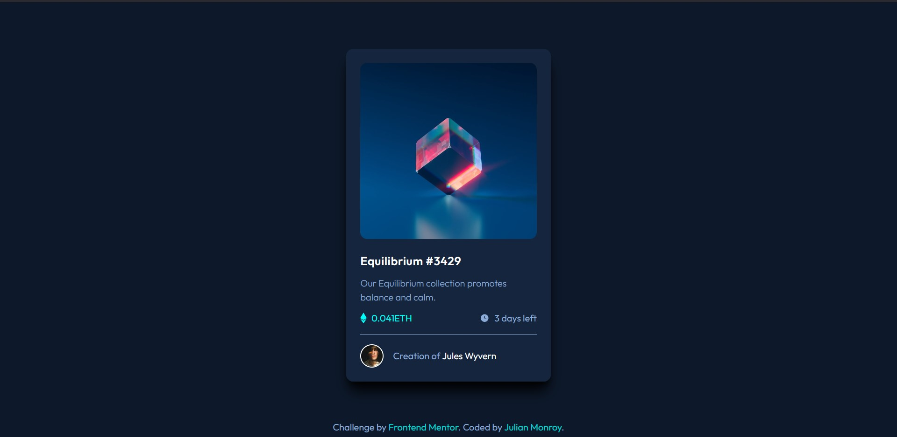

# Frontend Mentor - NFT Card Component

This is a solution to the [NFT Card Component](https://www.frontendmentor.io/challenges/results-summary-component-CE_K6s0maV). Frontend Mentor challenges help you improve your coding skills by building realistic projects.

## Table of contents

- [Overview](#overview)
  - [Screenshot](#screenshot)
  - [Links](#links)
- [My process](#my-process)
  - [Built with](#built-with)
  - [What I learned](#what-i-learn)
  - [Continued development](#continued-development)
  - [Useful resources](#useful-resources)
- [Author](#author)

## Overview

### Screenshot

### Links

- Solution URL: (https://github.com/groverush/nft-card-component)
- Live Site URL: (https://nft-card-equilibrium.netlify.app/)

## My process

### Built with

- Mobile-first workflow
- [React](https://reactjs.org/) - JS library
- [tailwindcss](https://tailwindcss.com/) - React framework

### What I learn

In this challenge I learned about how to use the :hover pseudo-class with the ::before pseudo-element.
I decided to do this challenge using tailwindcss and react to practice with these frameworks.

### Continued development

I want to continue focusing on small details and finding new challenges to improve as a developer.

### Useful resources

- [tailwindcss](https://tailwindcss.com/) - This helped me defining the styles. I really liked this css framework and will use it going forward.

## Author

- Website - [Julian Monroy](https://app.netlify.com/teams/groverush/overview)
- Frontend Mentor - [@groverush](https://www.frontendmentor.io/profile/groverush)
